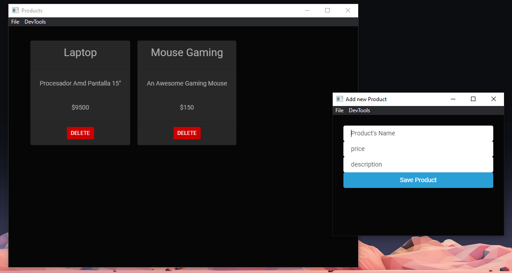

# App de Tienda en ElectronJs

Aplicacion de Tienda desarrollada con ElectronJs lista para ser empaquetada en distintas distribuciones

# Screenshot



### Pre-requisitos 📋

_Requisitos_

```
NodeJS
```

```
Electron
```

```
Electron-reload
```

```
Electron-Packager
```

### Instalación 🔧

Primero clonamos el repositorio
Instalamos electron

```
npm i electron
```

Instalamos electron-reload

```
npm i electron-reload
```

Instalamos electron-packager

```
npm i electron-packager
```

Ejecutamos el programa

```
npm start
```

## Construido con 🛠️

- [NodeJs](https://nodejs.org/es/) - Runtime environment

- [Electron](https://www.electronjs.org/) - El framework usado
